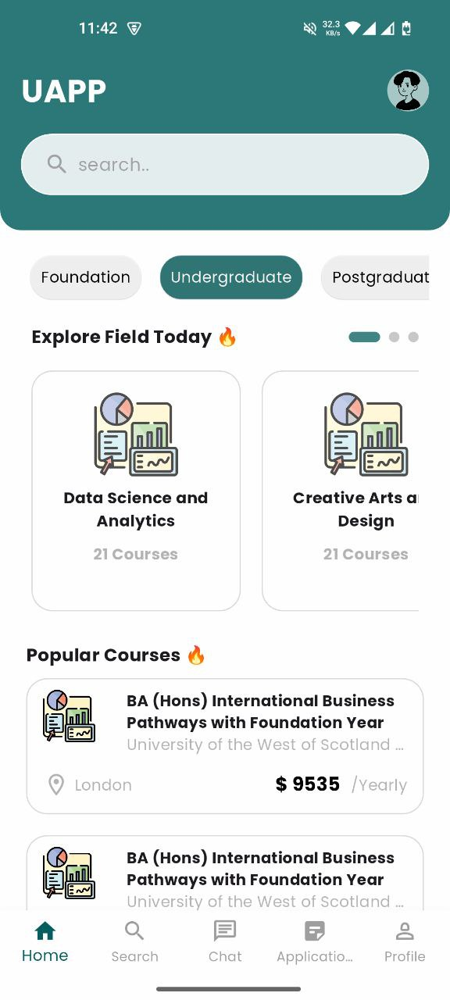
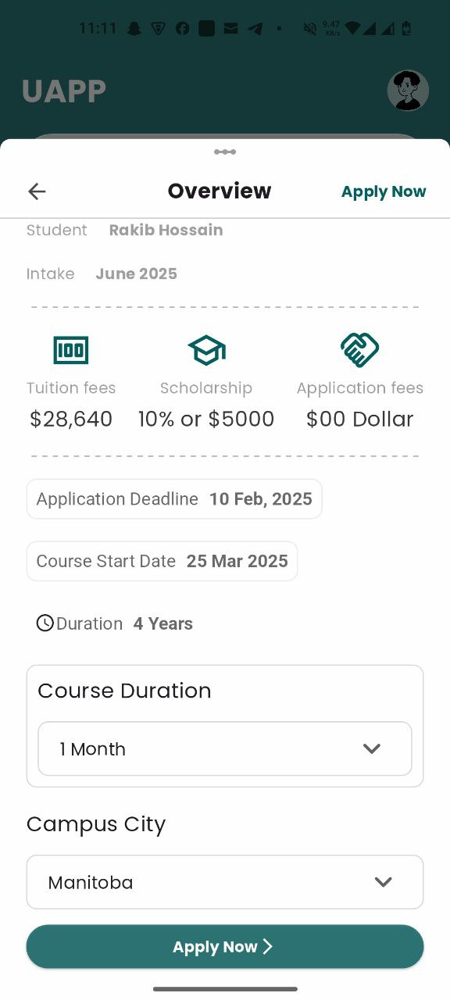
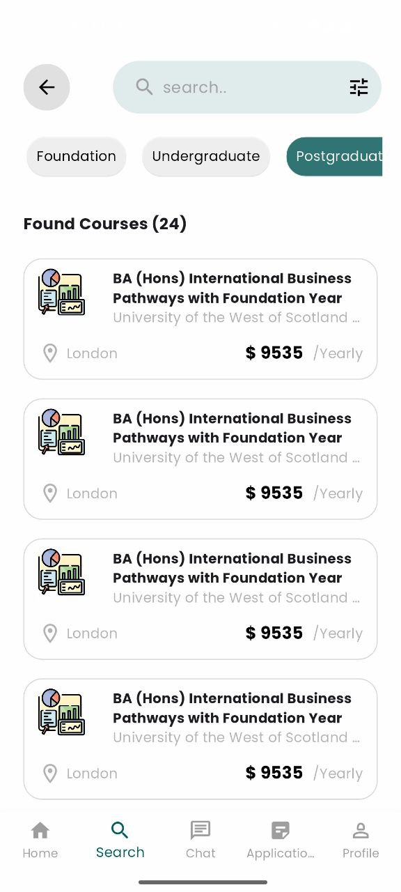
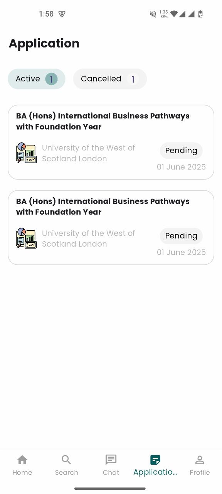
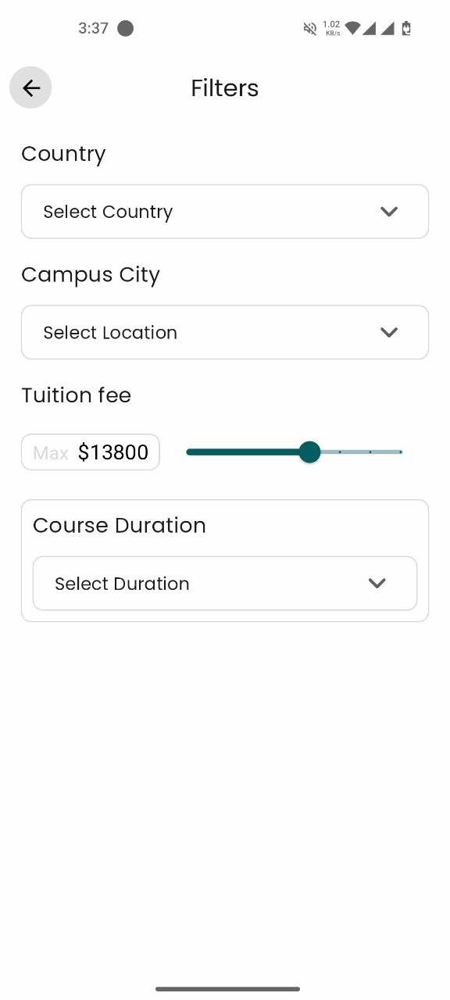
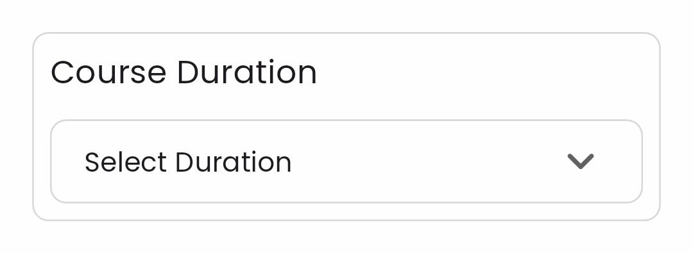
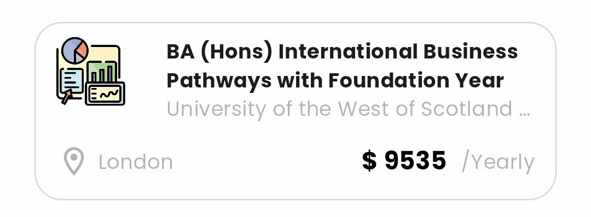

### 🚀 Project Overview
This is a task based project for an interview purpose. I have to clone a Figma design using Flutter. This project shows some screens having some simple and critical functionalities.

### 📸 Screenshots
<div style="display: flex; flex-wrap: wrap; justify-content: space-around; align-items: flex-start; gap: 15px;">
    

   
      
      
</div>

### 🛠️ Technologies Used
List the main technologies, frameworks, and packages used in your project.
- Flutter - UI Toolkit
- Dart - Programming Language
- GetX - State Management, Dependency Injection, Routing
- Packages - `get` `smooth_page_indicator`
- Network - null
- Design pattern - MVC

### ♻️ Reusable Components
This custom widget is originally created in `filter_screen`. And used both `Filter` & `Overview` pages. This custom widget is highly customisable that anyone can keep the border or not. also can change the `title text`, `controller` and `drop down items`.
<div style="display: flex; flex-wrap: wrap; justify-content: space-around; align-items: flex-start; gap: 15px;">
    
</div>

This custom widget is originally created in `home_screen`. And used both `Home` & `Search` pages.
<div style="display: flex; flex-wrap: wrap; justify-content: space-around; align-items: flex-start; gap: 15px;">
   
</div>

### 📂 Project Structure
```
├───lib
│   └───app
│       ├───bindings
│       ├───core
│       └───modules
│           ├───application
│           │   ├───controller
│           │   ├───model
│           │   └───screen
│           ├───chat
│           │   ├───controller
│           │   └───screen
│           ├───home
│           │   ├───controller
│           │   ├───model
│           │   └───screen
│           ├───mainNavBar
│           │   ├───controller
│           │   └───screen
│           ├───profile
│           │   ├───controller
│           │   └───screen
│           └───search
│               ├───controller
│               ├───filters
│               │   ├───controller
│               │   ├───model
│               │   └───screen
│               └───screen
```